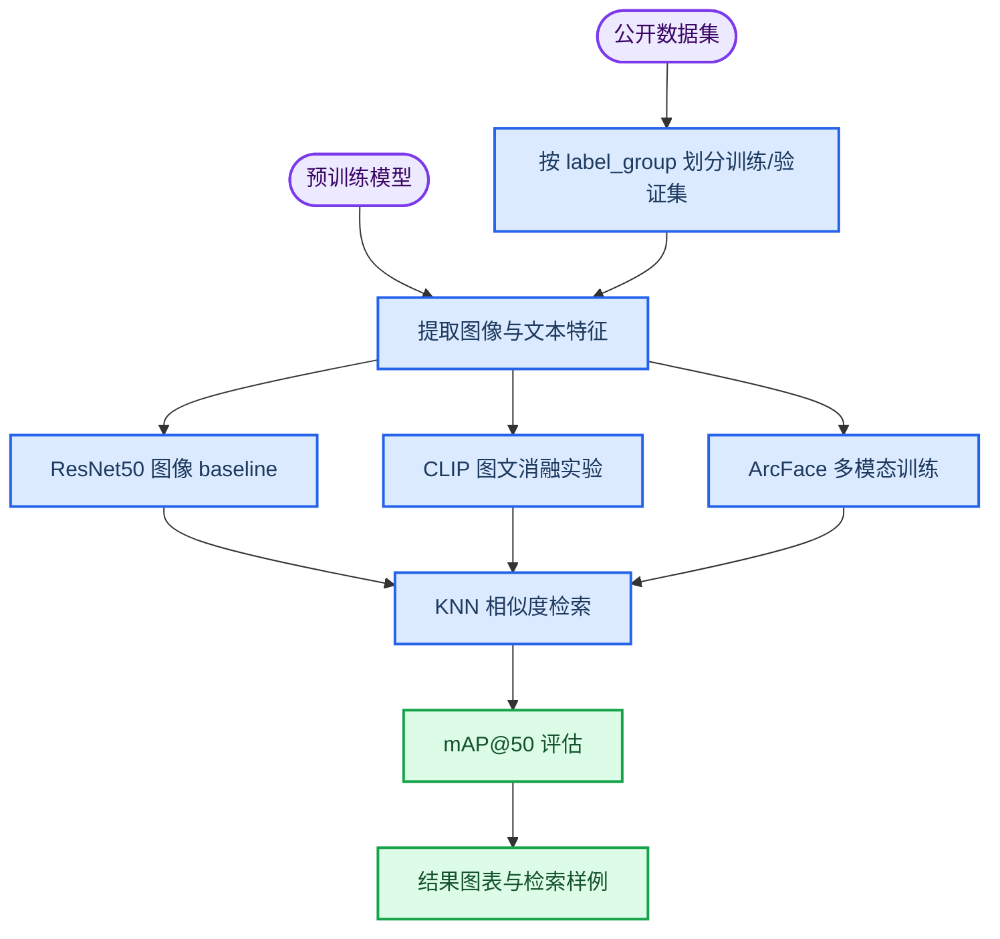
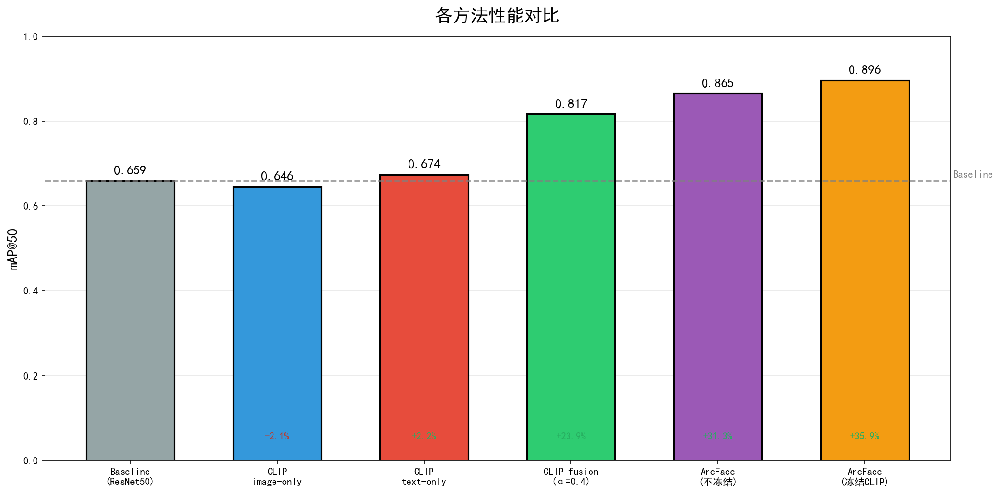
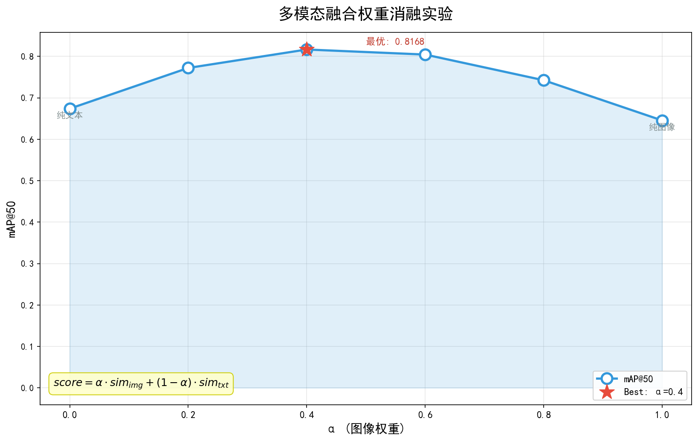

# Shopee 商品同款识别多模态检索系统

_基于 Shopee Price Match Guarantee 数据集的图文多模态商品匹配课程项目。_

---

本项目面向电商场景中的“同款商品识别”问题：给定商品图片与标题文本，系统需要从候选商品中检索出同一商品或高度相似商品。项目实现并比较了纯图像检索、CLIP 图文检索、多模态融合和 ArcFace 度量学习方案，最终在默认验证集划分上取得 `mAP@50 = 0.89610` 的最好结果。

> **说明：**仓库只保留代码、说明文档、轻量实验结果和可视化图。完整训练图片、预训练权重、训练 checkpoint、embedding 缓存和完整预测文件体积较大，均通过 `.gitignore` 排除，并在本文档中给出下载或复现方式。

## 项目亮点

- **多模态建模：**同时利用商品图片和标题文本，缓解单一图像特征在相似外观、不同语义商品上的误匹配问题
- **检索式评估：**使用 KNN 相似度检索，并以 `mAP@50` 衡量 Top-K 同款召回质量
- **系统对比完整：**覆盖 ResNet50 baseline、CLIP image-only、CLIP text-only、CLIP 融合、ArcFace 微调和冻结 CLIP 的 ArcFace 方案
- **可复现实验：**固定 `seed=42`，采用按 `label_group` 分组的验证集划分，避免同组泄漏
- **仓库体积可控：**大文件不进入 Git 历史，README 明确数据、模型和 checkpoint 的复现路径

## 项目结构

```text
.
├── scripts/
│   ├── baseline.py             # ResNet50 图像检索 baseline
│   ├── ablation.py             # CLIP 图像/文本/融合消融实验
│   ├── enhanced.py             # CLIP + ArcFace 多模态微调
│   ├── enhanced_frozen.py      # 冻结 CLIP encoder 的 ArcFace 训练
│   ├── visualize.py            # 汇总实验结果并绘图
│   └── vis_results.py          # 生成 Top-K 检索可视化样例
├── outputs/
│   ├── baseline/baseline_result.json
│   ├── ablation/ablation_result.json
│   ├── enhanced/training_result.json
│   ├── enhanced_frozen/training_result.json
│   └── visualizations/*.png
├── data/README.md              # 数据下载与放置说明
├── models/README.md            # 模型权重下载说明
├── requirements.txt
├── retrieval_visualization.png
├── retrieval_visualization.pdf
└── 14组-商品同款图像检测系统.pptx
```

## 方法流程



## 环境配置

建议使用 Python 3.9 或更高版本。当前项目在本地 Python 3.11 环境下完成语法检查。

```powershell
python -m venv .venv
.\.venv\Scripts\Activate.ps1
python -m pip install --upgrade pip
pip install -r requirements.txt
```

如果使用 GPU，请先根据本机 CUDA 版本安装匹配的 PyTorch 版本，再安装其余依赖。`faiss` 是可选依赖；未安装时脚本会自动回退到 `sklearn.neighbors.NearestNeighbors`。

## 数据准备

数据集来自 Kaggle 的 Shopee Price Match Guarantee competition[^1]。下载后请按以下结构放置：

```text
data/
  train.csv
  train_images/
    0000a68812bc7e98c42888dfb1c07da0.jpg
    ...
```

默认脚本路径：

| 参数 | 默认值 | 说明 |
| --- | --- | --- |
| `--csv_path` | `data/train.csv` | 商品元数据与标签 |
| `--image_dir` | `data/train_images` | 商品训练图片目录 |
| `--val_ratio` | `0.2` | 验证集比例 |
| `--seed` | `42` | 随机种子 |
| `--topk` | `50` | 检索 Top-K 数量 |

## 模型准备

### CLIP ViT-B/32

多模态实验使用 `openai/clip-vit-base-patch32`[^2]。脚本中启用了 `local_files_only=True`，因此需要先把模型下载到本地：

```powershell
huggingface-cli download openai/clip-vit-base-patch32 --local-dir models/clip-vit-base-patch32
```

期望目录：

```text
models/
  clip-vit-base-patch32/
    config.json
    pytorch_model.bin
    preprocessor_config.json
    tokenizer.json
    ...
```

### ResNet50 ImageNet V2

Baseline 使用 TorchVision 的 ResNet50 ImageNet V2 权重[^3]：

```powershell
mkdir models\resnet50
python -c "from torchvision.models import ResNet50_Weights; import os, torch; os.makedirs('models/resnet50', exist_ok=True); sd = ResNet50_Weights.IMAGENET1K_V2.get_state_dict(progress=True); torch.save(sd, 'models/resnet50/resnet50_imagenet1k_v2.pth')"
```

期望文件：

```text
models/resnet50/resnet50_imagenet1k_v2.pth
```

## 运行实验

### 1. ResNet50 baseline

纯图像检索基线，使用 ResNet50 提取图像 embedding，再做余弦相似度 KNN 检索。

```powershell
python scripts\baseline.py
```

主要输出：

```text
outputs/baseline/baseline_result.json
outputs/baseline/baseline_predictions.json      # 已忽略，不提交
outputs/baseline/val_resnet_emb.npy             # 已忽略，不提交
```

### 2. CLIP 图文消融实验

比较 CLIP image-only、text-only，以及不同 `alpha` 下的图文融合：

```powershell
python scripts\ablation.py
```

融合公式：

```text
score = alpha * image_similarity + (1 - alpha) * text_similarity
```

默认扫描：

```text
alpha = [1.0, 0.8, 0.6, 0.4, 0.2, 0.0]
```

### 3. ArcFace 多模态训练

完整 CLIP 微调版本：

```powershell
python scripts\enhanced.py
```

冻结 CLIP encoder 版本：

```powershell
python scripts\enhanced_frozen.py
```

冻结版本只训练投影层、融合层和 ArcFace head，训练参数更少，实验中表现更稳定。

### 4. 生成结果图表

```powershell
python scripts\visualize.py
```

输出目录：

```text
outputs/visualizations/
  fig1_main_results.png
  fig2_ablation_alpha.png
  fig3_training_curve.png
  fig4_training_curve_frozen.png
  fig5_summary_table.png
```

### 5. 生成检索样例

```powershell
python scripts\vis_results.py
```

输出文件：

```text
retrieval_visualization.png
retrieval_visualization.pdf
```

## 实验结果

以下结果均来自默认分组验证集划分：`seed=42`，`val_ratio=0.2`，指标为 `mAP@50`。

| 方法 | 模态 | 关键设置 | mAP@50 |
| --- | --- | --- | ---: |
| ResNet50 baseline | 图像 | ImageNet V2 预训练，无微调 | 0.65918 |
| CLIP image-only | 图像 | `alpha=1.0` | 0.64558 |
| CLIP text-only | 文本 | `alpha=0.0` | 0.67401 |
| CLIP fusion | 图像 + 文本 | `alpha=0.4` | 0.81675 |
| ArcFace multimodal fine-tuning | 图像 + 文本 | CLIP 参与训练 | 0.86530 |
| ArcFace with frozen CLIP encoders | 图像 + 文本 | 冻结 CLIP encoder | **0.89610** |


_Figure 1: 不同方法在默认验证集上的 mAP@50 对比。_


_Figure 2: CLIP 图像特征和文本特征在不同融合权重下的表现。_

## 结果解读

- ResNet50 baseline 能提供稳定的视觉相似度基线，但缺少文本语义信息
- CLIP text-only 高于 CLIP image-only，说明商品标题对同款识别有明显贡献
- CLIP fusion 在 `alpha=0.4` 时效果最好，表明文本信息在该任务中权重更高
- ArcFace 训练显著提升了类内聚合与类间区分能力
- 冻结 CLIP encoder 的 ArcFace 版本取得最好结果，说明在当前数据规模和训练设置下，保留 CLIP 预训练表征并只学习任务投影层更稳健

## 大文件管理策略

本仓库没有提交以下文件：

| 路径 | 原因 | 处理方式 |
| --- | --- | --- |
| `data/train_images/` | 原始图片数量多、体积大 | 从 Kaggle 下载 |
| `data/train.csv` | 数据集文件 | 从 Kaggle 下载 |
| `models/clip-vit-base-patch32/` | CLIP 权重约数百 MB | 从 Hugging Face 下载 |
| `models/resnet50/*.pth` | ResNet50 权重接近 100 MB | 用 TorchVision 下载 |
| `outputs/**/checkpoints/` | 训练 checkpoint 约数百 MB | 本地训练生成 |
| `outputs/**/*.npy` | embedding 缓存 | 本地运行生成 |
| `outputs/**/*predictions*.json` | 完整预测文件较大 | 本地评估生成 |

如果后续需要公开 checkpoint，建议使用 GitHub Releases、Kaggle Dataset 或 Hugging Face Hub，而不是直接提交到 Git。

## 常见问题

### 为什么 README 里有结果，但仓库里没有 checkpoint？

checkpoint 文件体积过大，不适合进入普通 Git 仓库。仓库保留了轻量结果 JSON 和图表，完整模型可以按本文档的数据与模型准备步骤重新训练得到。

### 为什么 CLIP 模型必须先下载到本地？

训练脚本使用 `local_files_only=True`，这样可以保证实验运行时不依赖临时网络状态，也避免每次运行重复下载模型。

### 没有 GPU 能运行吗？

可以运行 baseline 和部分小规模验证，但 CLIP 特征提取与 ArcFace 训练会明显变慢。建议使用 CUDA GPU 复现实验结果。

### 可以只看结果不重新训练吗？

可以。仓库已保留 `outputs/*/*_result.json`、`outputs/visualizations/*.png`、`retrieval_visualization.png` 和课程展示 PPT，用于直接查看实验结论。

## 参考资料

[^1]: Kaggle. "Shopee - Price Match Guarantee." https://www.kaggle.com/c/shopee-product-matching/data

[^2]: Hugging Face. "openai/clip-vit-base-patch32." https://huggingface.co/openai/clip-vit-base-patch32

[^3]: PyTorch. "TorchVision ResNet50 Weights." https://pytorch.org/vision/main/models/generated/torchvision.models.resnet50.html
